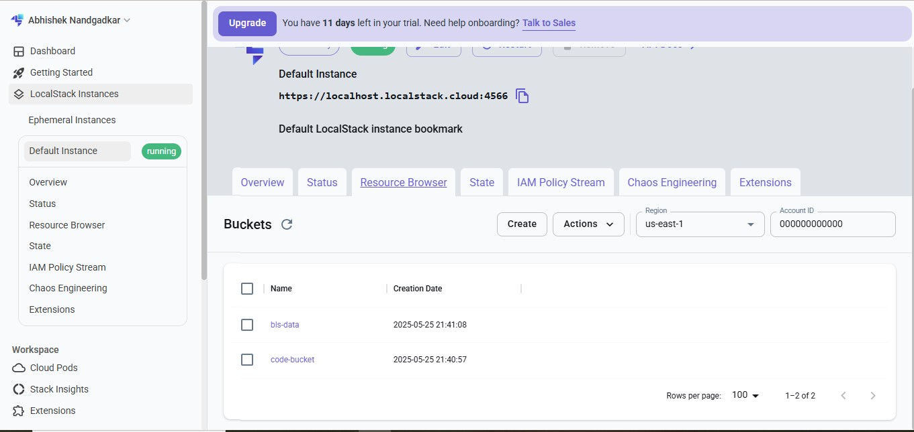
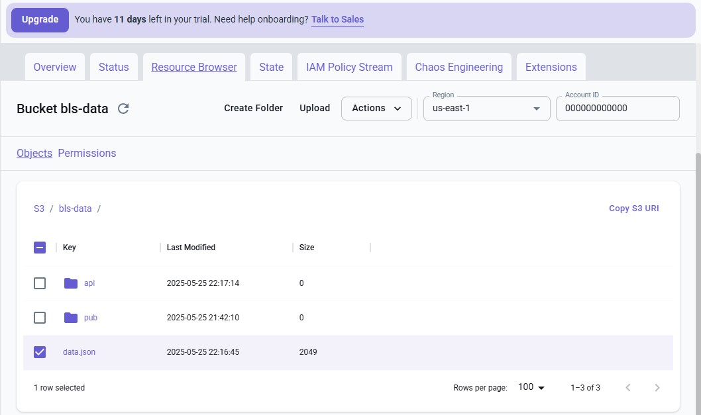
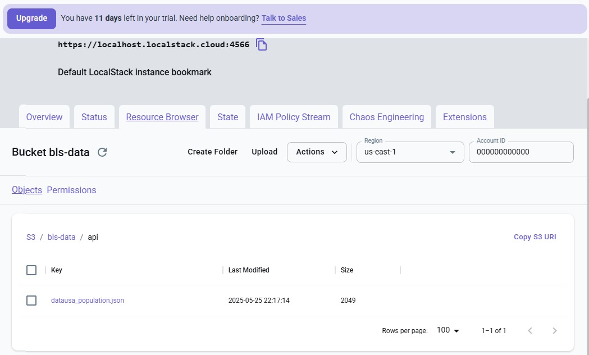
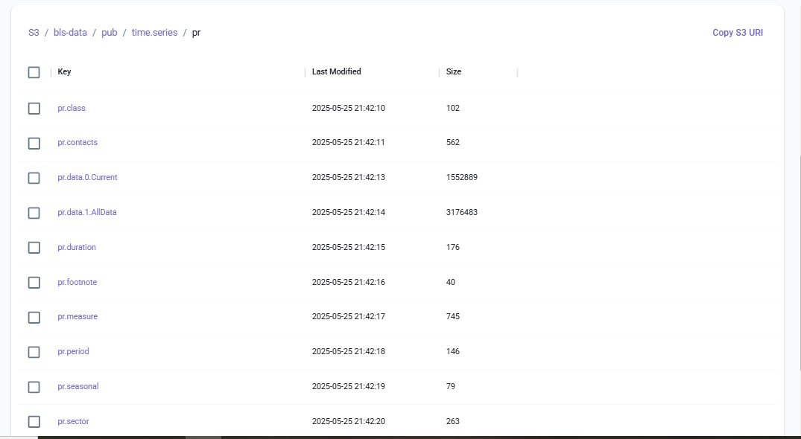
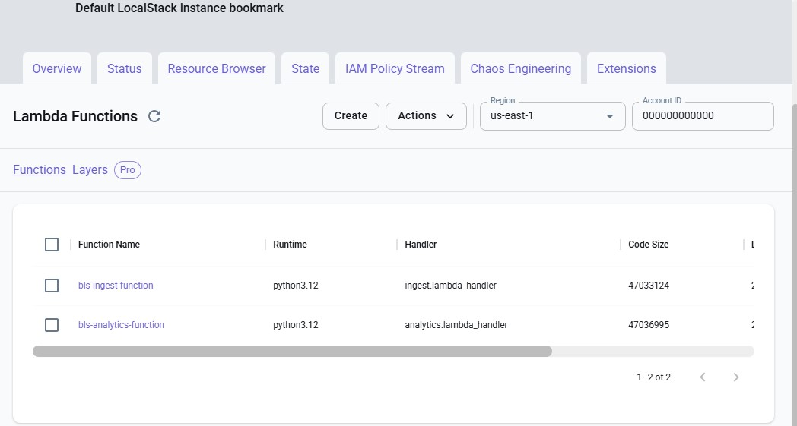
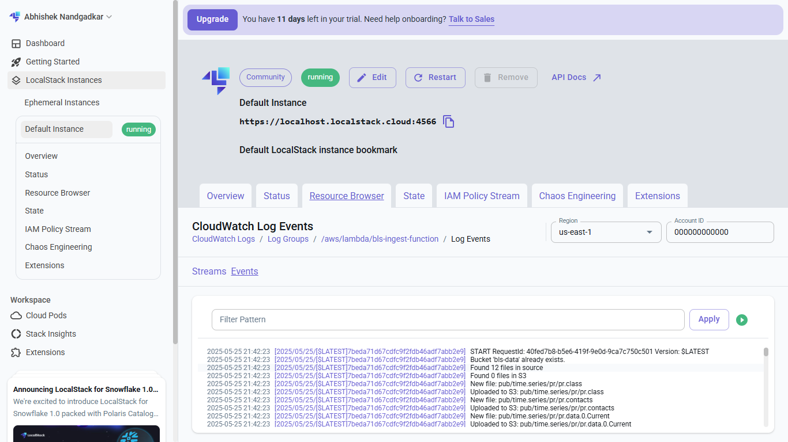
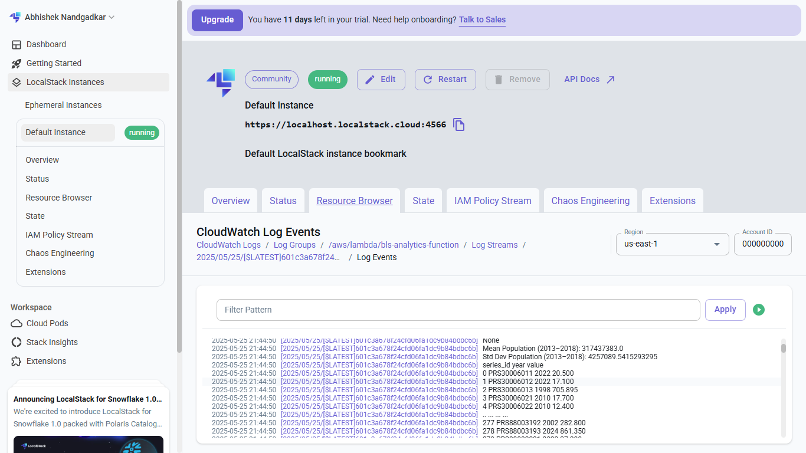

# 🧠 Rearc Data Engineering Quest 

This project demonstrates an end-to-end data engineering pipeline using **Python, AWS S3, Lambda, SQS, and CloudFormation** (with LocalStack for local development). It fetches open data from public sources, syncs it to S3, triggers processing pipelines, and generates insights automatically.

---

## ⚠️ Note on Environment

This project uses **LocalStack (Pro Trial)** for simulating AWS services (S3, Lambda, SQS, IAM, etc.).

Due to the nature of LocalStack:
- No real IAM enforcement (users/policies simulated only)
- S3 data is stored locally and not accessible via public AWS endpoints

🔐 If you'd like to reproduce or validate the results:
1. Clone the repo
2. Run LocalStack (`docker-compose` or `localstack start`)
3. Deploy using `build.sh`
4. Verify using `awslocal` CLI or LocalStack Web UI

## ✅ Step 1: Republish BLS Open Dataset to Amazon S3

- **S3 Bucket**: `bls-data`
- **Script**: [`step1_ingest_sync/ingest.py`](./step1_ingest_sync/ingest.py)

### Features:
- Scrapes BLS data file links from [BLS PR Series](https://download.bls.gov/pub/time.series/pr/)
- Syncs files to S3 (uploads new/updated, deletes missing)
- Handles HTTP 403 with proper headers (User-Agent for compliance)
- No hardcoded filenames
- Skips duplicates intelligently using Last-Modified header

---

## 🌐 Step 2: Fetch and Store Data from Public API

- **API Source**: [https://datausa.io/api/data?drilldowns=Nation&measures=Population](https://datausa.io/api/data?drilldowns=Nation&measures=Population)
- **Script**: [`step2_api_fetch/api_fetch.py`](./step2_api_fetch/api_fetch.py)
- **Output**: JSON file (`api/datausa_population.json`) stored in the same S3 bucket

### Features:
- Uses `requests` to fetch data
- Saves result to S3 under `api/datausa_population.json`

---

## 📊 Step 3: Analytics on Combined Data

- **Notebook**: [`step3_analytics/analytics.ipynb`](./step3_analytics/analytics.ipynb)

### Summary of Analysis:
- Loads BLS `.data` files and API JSON
- Cleans and transforms the datasets
- Performs basic population trend analysis and year-wise comparisons
- Uses Pandas for insights and logs results

---

## ⚙️ Step 4: Infrastructure as Code - Automated Data Pipeline

- **CloudFormation Template**: [`step4_pipeline/template.yaml`](./step4_pipeline/template.yaml)
- **Lambda Code**:
  - [`lambda/ingest.py`](./step4_pipeline/lambda/ingest.py): Combines Step 1 & Step 2 (runs daily)
  - [`lambda/analytics.py`](./step4_pipeline/lambda/analytics.py): Triggered via SQS on new `data.json`

## 📸 Screenshots

> The screenshots below show the S3 bucket `bls-data` inside LocalStack after successful ingestion from the BLS website and the public API.

### 🔹 S3 Bucket View

### 🔹 BLS Data Files

### 🔹 API JSON File

### 🔹 PR Series Files

---

### 📈 Lambda Logs Showing Analytics Output

#### 🔹 Lambda Functions

#### 🔹 Lambda Ingest Function Logs

#### 🔹 Lambda Analytics Function Logs
